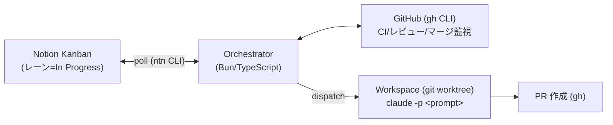

# baton

[](https://github.com/kterui9019/baton/actions/workflows/ci.yml)
[](https://www.npmjs.com/package/@kterui9019/baton)

カンバンデータベース（現在は Notion に対応）をエージェントオーケストレーターとして使い、チケットを **In Progress** レーンに動かすとローカルで Claude Code が走って実装 → PR 作成 → CI 監視 → レビュー対応 → カンバン更新まで自動化する常駐デーモンです。[openai/symphony](https://github.com/openai/symphony/blob/main/SPEC.md) のローカル版。



## 必要なもの

- **macOS**（常駐化が launchd 前提のため。`baton --once` 等の手動実行なら他 OS でも動作します）
- **Bun** >= 1.3（`baton` コマンド自体が `#!/usr/bin/env bun` で実行されるため必須。[bun.sh](https://bun.sh) からインストール）
- **ntn CLI**（[Notion CLI](https://developers.notion.com)。`ntn login` 済みで、対象 DB にアクセスできること）
- **claude CLI**（Claude Code）
- **gh CLI**（PR 作成・CI/レビュー監視用。`gh auth login` 済みであること）

## Notion データベースの準備

以下のプロパティを持つデータベースを用意します。**プロパティ名はすべて config で変更可能**です（下表の「config キー」列）。既定値と同じ名前でプロパティを作れば config の変更は不要です。

| プロパティ（既定名） | 型 | config キー | 用途 |
|---|---|---|---|
| Title | title | `titleProperty` | チケットのタイトル |
| Status | status | `laneProperty` | 状態管理。例: TODO / In Progress / Human Review / In Delivery / Released / Canceled |
| Repo | select | `repoProperty` | 対象リポジトリ名（選択肢としてリポジトリ名を登録） |
| Condition | select | `conditionProperty` | 実行条件。`Local` 等。この値が `conditionValue` と一致するチケットのみ実行 |
| PR | rich_text | `prProperty` | 作成した PR のリンク（自動書き込み） |
| Activity | rich_text | `activityProperty` | 実行状況の 1 行ステータス（自動書き込み） |

- Status（status）の選択肢は最低限、`kanban.triggerLanes`（実行トリガー）、`kanban.doneLane`（レビュー待ち）、`kanban.mergedLane`（マージ後）、`kanban.terminalLanes`（終了）に対応するものが必要です。
- **DB に無いプロパティは config で空文字 `""` を設定すればスキップされます**（例: `"kanban": { "notion": { "prProperty": "" } }` にすると PR リンクの読み書きを一切しない）。必須なのは Title / Status / Repo / Condition の 4 つです。

### dataSourceId の取得

config に設定する `kanban.notion.dataSourceId` は database_id とは別物です。ntn CLI で database_id（DB ページの URL に含まれる 32 桁の ID）から解決できます:

```sh
ntn datasources resolve <database_id>
```

ntn を使わない場合は、Notion API の `GET /v1/databases/{database_id}` のレスポンスに含まれる `data_sources` 配列の `id` を参照してください。

## セットアップ

```sh
# 0. インストール
npm i -g @kterui9019/baton

# 1. 設定ファイル一式を ~/.config/baton に作成
baton init

# 2. ~/.config/baton/config.json の必須項目を編集
#    - kanban.notion.dataSourceId: 上記で取得した ID
#    - repoRoot: ローカルリポジトリを置く親ディレクトリ（例 ~/repos）
#    - gitRemotePrefix: clone 元 URL のプレフィックス（例 git@github.com:your-org/）
#    プロパティ名を既定と変えている場合は kanban.notion.*Property 系も合わせる

# 3. dry-run で候補検出と設定を確認（書き込み・エージェント起動なし）
baton --once --dry-run

# 4. 問題なければ常駐化（launchd）
baton launchd install
```

`config.json` は `~/.config/baton/config.json`（`$XDG_CONFIG_HOME` があればそちら配下）に置かれ、npm パッケージ自体（コード）とは独立しています。state / logs / workspaces（git worktree の実体）もすべて同じディレクトリ配下に作られます。設定はデーモン再起動なしで反映されます（tick ごとに mtime を見て再読込）。

リポジトリを直接開発する場合は `git clone` → `bun install` の上で `bun run start` 等（後述）を使ってください。

### 起動コマンド

```sh
baton               # フォアグラウンドで常駐
baton --once        # 1 tick だけ実行
baton --once --dry-run  # 1 tick を dry-run（書き込みなし）
baton status        # 稼働状況の確認
baton --config <path>   # config.json の場所を明示的に指定
```

リポジトリを clone して開発する場合は `bun run start` / `bun run once` / `bun run dry-run` / `bun run status` が同等（内部で `bun src/main.ts ...` を実行、`--config` を渡さない限りやはり `~/.config/baton/config.json` を見る）。

### 常駐化（launchd, macOS）

```sh
baton launchd install    # 登録して起動（ログイン時自動起動・異常終了時再起動）
baton launchd uninstall  # 解除
tail -f ~/.config/baton/logs/launchd.out.log    # ログ
```

launchd のラベルは既定で `com.<ユーザー名>.baton`。変えたい場合は環境変数 `BATON_LABEL` を設定して install/uninstall を実行してください。

## 動作フロー

1. カンバンをポーリング（既定 30 秒間隔）し、`Status ∈ triggerLanes` かつ `Condition = Local` かつ `Repo` 設定済みのチケットを検出
2. 対象リポジトリ（`repoRoot` 配下、なければ自動 clone）から `workspaces/` に git worktree を作成し、専用ブランチをチェックアウト。`repoSetup` の設定に従い `.env` 等のコピーとセットアップコマンドを実行
3. チケット本文を含むプロンプトで `claude -p` をヘッドレス起動（同時実行は既定 2 件まで）
4. エージェントが実装・テスト・push・`gh pr create` まで実施し、結果 JSON を報告
5. **PR 作成後はレーンを動かさず In Progress のまま CI を監視**（`PR` リンク書き込み）
6. **CI が全部グリーンになったら** レーンを **Human Review** へ移動
7. レビュー結果に応じて:
   - **(a) GitHub で changes requested** → 指摘内容（レビュー本文 + インラインコメント）を取り込んで**自動で修正**し、同じ PR を更新
   - **(b) Notion コメントでフィードバックを書いてレーンを In Progress に戻す** → コメントを取り込んでやり直し（rework）。同じブランチ・同じ PR が更新される
   - **(c) PR をマージ** → レーンを **In Delivery** へ自動移動 🚀
8. CI が失敗した場合も失敗ログを取り込んで自動修正（同一コミットへの再発火はせず、上限は既定 3 回。超えたら 🆘 を通知して人間待ち）
9. レーンが Released / Canceled になったチケットの worktree は自動掃除

失敗時はバックオフ付きリトライ（既定 2 回まで）。それでもダメなら `Activity` に ❌ とコメントでエラー詳細を残し、カードを人間が編集/移動するまで再実行しません。実行中にカードを In Progress から人間が動かすと、そのエージェントは中断（kill）されます。

### 質問エスカレーション（needs_info）

要件が曖昧・判断が必要など「人間の回答があれば続行できる」場合、エージェントは失敗ではなく**質問**を報告します:

1. レーンは動かさず、`Activity` に **❓ 要回答**、質問をページコメントとして投稿
2. 人間がそのコメントに返信（またはページにコメント追加、またはページ本文を編集）
3. 次のポーリングで回答を検知し、質問と回答をプロンプトに含めて**自動で再開**

## チケットの書き方

- **Title** と本文に実装内容を書く。本文はそのままプロンプトに入ります
- **Repo** と **Condition = Local** を設定
- **In Progress** に動かすと数十秒以内に着手されます
- 失敗後にやり直したいときは、カードを一度別レーンに出して戻す（またはカードを編集する）と再実行されます

## 設定リファレンス（config.json）

すべてのキーはデフォルト値を持ち、部分指定で構いません（deep merge）。`~` はホームに展開されます。

設定は `kanban`（カンバンプロバイダー）・`agent`（コーディングエージェント）・それ以外（プロバイダー非依存の共通設定）の3つに分かれています。各 namespace 内の `provider` が現在有効な実装を示し、それぞれのプロバイダー固有設定は同名のキー（`kanban.notion` / `agent.claude`）にネストします。将来カンバンやエージェントを複数対応する際、破壊的変更の影響は該当 namespace 内に閉じます。

### 共通設定（トップレベル）

| キー | 型 | 既定値 | 説明 |
|---|---|---|---|
| `pollIntervalMs` | number | `30000` | カンバンのポーリング間隔 (ms) |
| `maxConcurrent` | number | `2` | 同時実行エージェント数 |
| `repoRoot` | string | `"~/repos"` | ローカルリポジトリの親ディレクトリ |
| `repoMapping` | object | `{}` | カンバンのリポジトリ名 → ローカルディレクトリ名の対応（名前が食い違う場合） |
| `gitRemotePrefix` | string | `""` | 自動 clone に使う URL プレフィックス（例 `git@github.com:your-org/`）。`autoClone: true` なら必須 |
| `autoClone` | boolean | `true` | リポジトリが無いとき `<gitRemotePrefix><名前>.git` を自動 clone する |
| `branchTemplate` | string | `"feature/notion-{id}/{slug}"` | 作業ブランチ名。`{id}` = page_id 先頭 8 文字、`{slug}` = タイトルの slug |
| `setupTimeoutMs` | number | `600000` | セットアップコマンド 1 本あたりの最大実行時間（10 分） |
| `repoSetup` | object | `{}` | リポジトリ別の worktree セットアップ（下記） |
| `ghCommand` | string | `"gh"` | gh CLI のコマンド名（PR 監視用） |
| `prPollIntervalMs` | number | `60000` | PR 監視（CI/レビュー/マージ）のポーリング間隔 (ms) |
| `autoReworkLimit` | number | `3` | CI 失敗起因の自動修正回数の上限 |
| `promptTemplate` | string | `"prompts/task.md"` | プロンプトテンプレートのパス（絶対パス or `~/.config/baton` 相対。`baton init` で `~/.config/baton/prompts/task.md` にひな形がコピーされる） |
| `systemPromptTemplate` | string | `""` | システムプロンプト追加用テンプレートのパス。`""` で無効。指定時は `promptTemplate` と同じ変数で描画し `claude --append-system-prompt` として渡す（下記） |

### kanban（カンバンプロバイダー）

| キー | 型 | 既定値 | 説明 |
|---|---|---|---|
| `kanban.provider` | `"notion"` | `"notion"` | 現在有効なカンバン実装 |
| `kanban.triggerLanes` | string[] | `["In Progress"]` | このレーンのチケットを実行対象にする |
| `kanban.doneLane` | string | `"Human Review"` | CI グリーン後の移動先レーン |
| `kanban.mergedLane` | string | `"In Delivery"` | PR マージ検知時の移動先レーン |
| `kanban.terminalLanes` | string[] | `["Released", "Canceled"]` | このレーンに入ったら worktree と state を掃除 |

#### kanban.notion（Notion 固有）

| キー | 型 | 既定値 | 説明 |
|---|---|---|---|
| `kanban.notion.dataSourceId` | string | `""` | **必須**。対象データソース ID（取得方法は上記） |
| `kanban.notion.conditionProperty` | string | `"Condition"` | 実行条件プロパティ名 (select) |
| `kanban.notion.conditionValue` | string | `"Local"` | この値のチケットのみ実行 |
| `kanban.notion.laneProperty` | string | `"Status"` | レーンプロパティ名 (status) |
| `kanban.notion.repoProperty` | string | `"Repo"` | リポジトリプロパティ名 (select) |
| `kanban.notion.titleProperty` | string | `"Title"` | タイトルプロパティ名 (title) |
| `kanban.notion.prProperty` | string | `"PR"` | PR リンクプロパティ名 (rich_text)。`""` でスキップ |
| `kanban.notion.activityProperty` | string | `"Activity"` | アクティビティプロパティ名 (rich_text)。`""` でスキップ |
| `kanban.notion.ntnCommand` | string | `"ntn"` | ntn CLI のコマンド名 |

### agent（コーディングエージェント）

| キー | 型 | 既定値 | 説明 |
|---|---|---|---|
| `agent.provider` | `"claude" \| "takt"` | `"claude"` | 現在有効なエージェント実装 |
| `agent.timeoutMs` | number | `3600000` | 1 試行の最大実行時間（60 分） |
| `agent.maxAttempts` | number | `2` | 最大試行回数（バックオフ付きリトライ） |

#### agent.claude（Claude Code 固有）

| キー | 型 | 既定値 | 説明 |
|---|---|---|---|
| `agent.claude.command` | string | `"claude"` | claude CLI のコマンド名 |
| `agent.claude.args` | string[] | `["--permission-mode", "bypassPermissions"]` | claude CLI への追加引数 |

#### agent.takt（[takt](https://github.com/nrslib/takt) 固有）

`provider: "takt"` のとき、プロンプトを `--task` 引数として渡した `takt --pipeline ...` をヘッドレス起動します。takt はさらに内部で claude/codex/opencode 等のプロバイダーへ処理を委譲するオーケストレーションCLIです。worktree・branch・commit・push・PR 作成は baton 側と `prompts/task.md` の指示で完結させるため、既定では `--skip-git` を付与して takt 自身のブランチ管理と二重にならないようにしています。

| キー | 型 | 既定値 | 説明 |
|---|---|---|---|
| `agent.takt.command` | string | `"takt"` | takt CLI のコマンド名 |
| `agent.takt.args` | string[] | `["--pipeline", "--skip-git", "--quiet"]` | takt CLI への追加引数（`--task <prompt>` は自動付与） |

`repoSetup` の例（gitignore された `.env` を持ち込み、依存をインストール）:

```json
"repoSetup": {
  "your-repo": {
    "copy": [".env", "packages/api/.env"],
    "commands": ["bun install"]
  }
}
```

- キーは Notion の **Repo** プロパティに設定した名前。
- `copy` は clone 元（`repoRoot` 配下の実リポジトリ）基準の相対パスの列挙。ファイル・ディレクトリ両対応（ディレクトリは再帰コピー）。worktree の外へは書き込めない。存在しないパスは警告を出してスキップ。
- `commands` は worktree をカレントに `sh -c` で順次実行。**非ゼロ終了はセットアップ失敗**としてリトライ対象になる。既存 worktree の再利用時はスキップされる。

### システムプロンプトの追加（systemPromptTemplate）

`promptTemplate`（`prompts/task.md`）はチケットごとの作業内容を記述するプロンプトですが、「このツール（baton）を通して呼び出されたエージェントである」という運用ルール自体は毎回共通です。`systemPromptTemplate` にテンプレートファイルを設定すると、`promptTemplate` と同じ変数（`{{title}}`, `{{page_id}}`, `{{page_url}}` など）で描画したうえで `claude --append-system-prompt` として毎回のエージェント起動に注入されます。

例えば `prompts/system.md` を用意し config で `"systemPromptTemplate": "prompts/system.md"` と設定すると:

```md
あなたの呼び出し元は Notion を監視してエージェントに作業を渡すツール（baton）です。
このタスクは Notion ページ {{page_id}}（{{page_url}}）に対応しています。

- 最終的な完了報告は本タスクのプロンプトで指示された result_file への JSON 書き込みで行ってください。
```

- チケット本文（`promptTemplate` の `{{body}}`）とは独立しているため、チケットごとに書き分ける必要はありません。ツール固有の運用ルール・利用可能な補助コマンド・命名規則などをここに集約できます。
- `""`（既定）のときは `--append-system-prompt` を付与せず、`claude` の既定システムプロンプトのみで動作します。

> ⚠️ 既定の `bypassPermissions` はエージェントが確認なしで任意のコマンドを実行できるモードです。挙動を絞りたい場合は `agent.claude.args` を変更してください。

## 運用

- **稼働状況**: `baton status` — state 上の各ページの状態（running / retry / done / failed / needs_info / PR 監視状況）を表示
- **dry-run**: `baton --once --dry-run` — 候補と dispatch 判定・除外理由を表示（書き込みなし）
- **ログ**（すべて `~/.config/baton` 配下）:
  - `logs/orchestrator.log` — オーケストレーターの JSONL ログ
  - `logs/runs/<page_id>-attempt<N>.log` — エージェントの生ログ（stream-json）
  - `logs/launchd.out.log` / `logs/launchd.err.log` — launchd 経由の標準出力/エラー
- **実行状態**: `~/.config/baton/state/state.json`（自動管理）

### トラブルシューティング

- **起動時に設定エラーで終了する**: `kanban.notion.dataSourceId` / `repoRoot` / `gitRemotePrefix` の必須チェックです。表示されたメッセージに従って config.json を修正してください
- **チケットが拾われない**: `baton --once --dry-run` で候補と除外理由を確認。`Condition` が空になっていないか、レーン名・プロパティ名が config と一致しているか
- **一度失敗したチケットが再実行されない**: 仕様です。カードを編集するか動かし直してください（`~/.config/baton/state/state.json` の該当エントリを消しても可）
- **❓ 要回答 のまま進まない**: 質問コメントに**返信**するかページに新規コメント/本文編集をしてください。bot 自身のコメントは回答と見なされません
- **🆘 CI 自動修正が上限に到達**: 人間が PR を直接修正するか、カードを編集して In Progress に戻すと再開できます

## ディレクトリ構成

クリーンアーキテクチャ（Domain / Use Cases / Interface Adapters / Infrastructure の4層、依存は常に内向き）で構成しており、Notion・Claude Code・GitHub・git worktree はすべて Interface Adapters 層の実装として差し替え可能になっています。

```
src/
  domain/               ビジネスルール。外部依存ゼロ、class を使わず型（判別Union）と純粋関数のみ
  use-cases/
    ports/              KanbanPort / CodingAgentPort / CodeHostPort / WorkspacePort / StateRepositoryPort
    orchestrator.ts      中核ユースケース（tick/dispatch/PR監視）。Port経由でのみ外部とやり取りする
    prompt-builder.ts    エージェントへのプロンプト組み立て
  interface-adapters/
    notion/              KanbanPort の Notion 実装（ntn CLI）
    claude/              CodingAgentPort の Claude Code 実装
    takt/                 CodingAgentPort の takt 実装
    github/               CodeHostPort の GitHub 実装（gh CLI）
    git/                  WorkspacePort の git worktree 実装
    persistence/          StateRepositoryPort の JSON ファイル実装
  infrastructure/        config・logger・プロセス実行・launchd など横断的関心事
  composition.ts          各 Port アダプタを組み立てて Orchestrator を構築する配線
  main.ts                 CLI エントリ
bin/baton.js  npm パッケージの実行エントリ（`#!/usr/bin/env bun`）
prompts/      エージェントに渡すプロンプトテンプレートのひな形（`baton init` で ~/.config/baton にコピー）
config.example.json  設定のサンプル（`baton init` で ~/.config/baton/config.json にコピー）
SPEC.md       詳細仕様
```

パッケージ本体（コード）とは別に、実行時のユーザーデータは `~/.config/baton`（`$XDG_CONFIG_HOME` があればそちら配下）にまとまっています:

```
~/.config/baton/
  config.json   設定（baton init で作成、gitignore 相当で個人管理）
  prompts/      プロンプトテンプレートの実体（編集可）
  workspaces/   チケットごとの git worktree（自動管理）
  state/        実行状態（state.json、結果ファイル）
  logs/         オーケストレーターログ + エージェントごとの生ログ (logs/runs/)、launchd ログ
```

Notion 以外のカンバンや Claude Code 以外のコーディングエージェントに対応する場合は、`interface-adapters/` に新しい実装（例: `interface-adapters/jira/jira-kanban-adapter.ts`）を追加し、`composition.ts` の配線を差し替えるだけで済みます。`use-cases/orchestrator.ts` の変更は不要です。

## 制限事項

- **GitHub 前提**: PR 作成・CI/レビュー/マージの監視は gh CLI（GitHub）に依存します。GitLab 等には対応していません
- **launchd は macOS のみ**: 他 OS では `baton` をフォアグラウンドで手動起動するか、任意のプロセスマネージャで常駐させてください
- **CI 監視は GitHub Actions のログ取得に最適化**: 外部 CI（CircleCI 等）は check 名と URL のみプロンプトに渡されます
- Notion へのアクセスは ntn CLI、認証は ntn の keychain 管理に依存します
